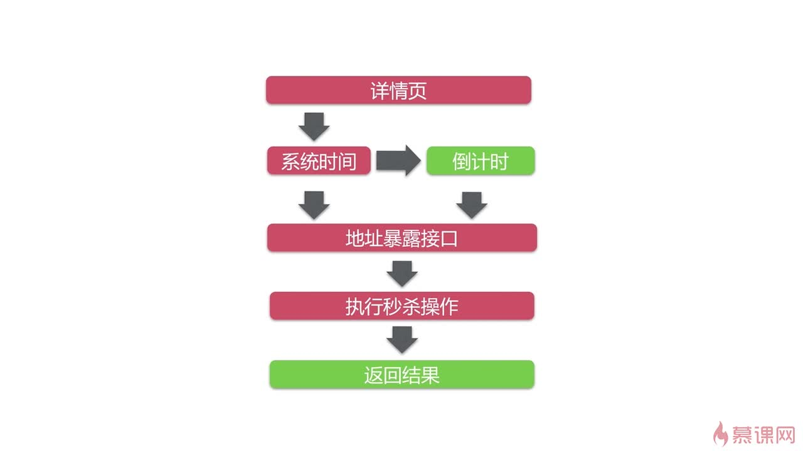
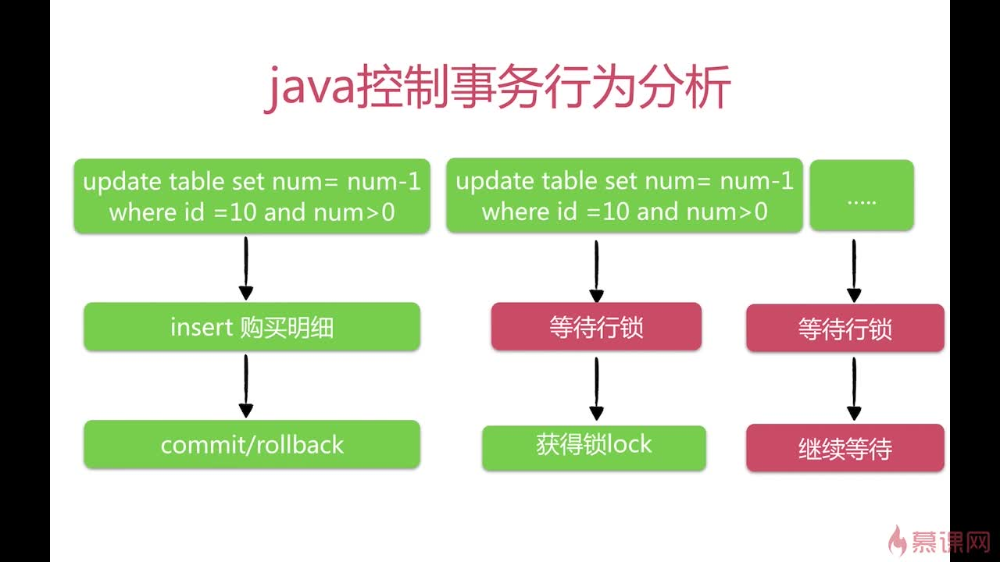
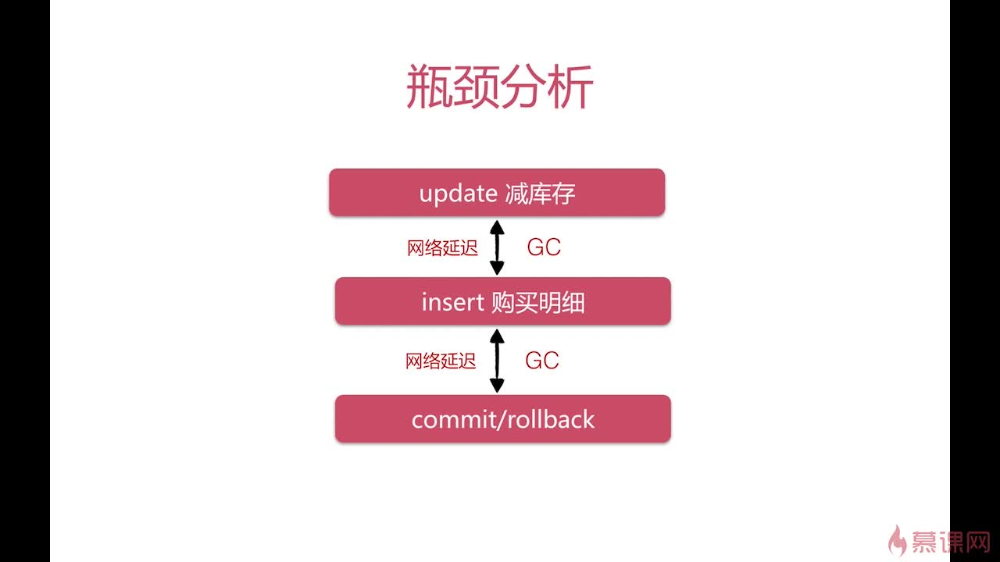
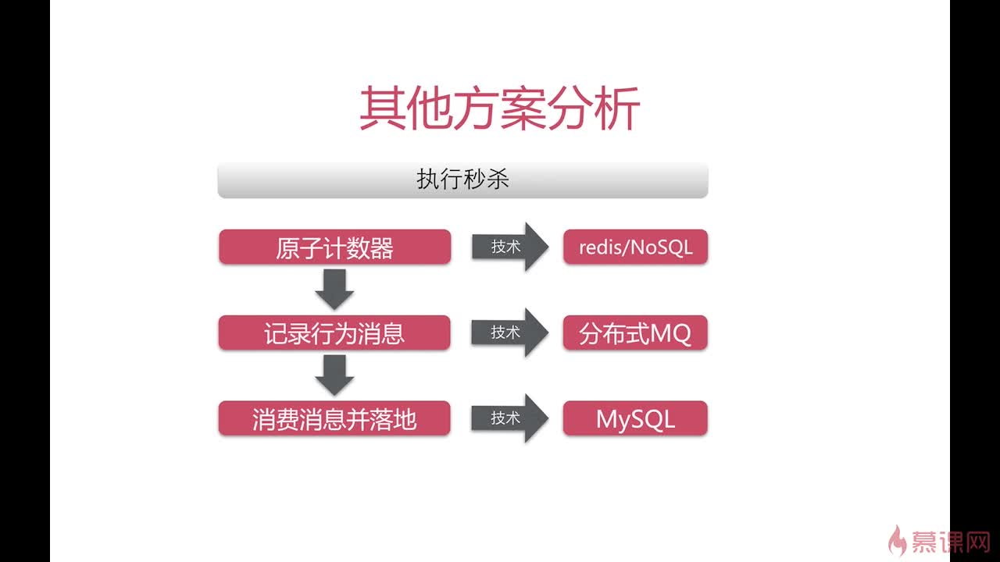

## 非常好的SSM框架整合案例
慕课网视频，是一个系列，自己点进去看吧。
 
 [课程链接](http://www.imooc.com/learn/587)

Java高并发秒杀案例，强烈推荐该课程！！！

-----

### 高并发笔记：
#### 优化分析

- CND缓存静态资源

- 客户机之间时间不一致，需要从服务器获取系统时间。Java访问
一次内存理论上10ns，不考虑GC的话1秒内可以获取1亿次，所以获
取服务器时间的过程不需要优化

- 获取秒杀接口地址不适合使用CDN缓存，适合放在服务器端缓存，如redis、memcache等。
官方数据1秒钟能抗10万个qps

- 秒杀操作不适合缓存，需要事务控制

### 解决方案
- 大公司解决方案，成本很高

- 基于我们自己的分析得到的解决方案
  - 把客户端逻辑放到MySQL服务端，避免网络延迟和GC的影响。
  - 如何放到MySQL服务端？两种办法
    - 定制SQL方案，修改MySQL源码。`update/*+[auto_commit]*/`
    - 使用存储过程，整个事物在MySQL端完成
  - 优化方向：因为行级锁在Commit之后释放，所以应减少行级锁持有时间